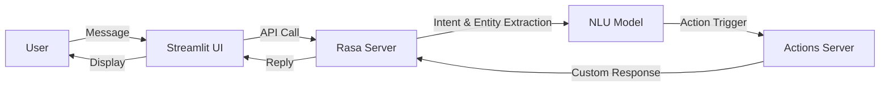

README.md

```markdown
# 🤖 Chatbot with Rasa, Custom Actions, and Streamlit

This project is a chatbot built using **Rasa** for natural language understanding (NLU) & dialogue management, with **Streamlit** as the frontend interface.  
The chatbot supports custom actions to fetch data, respond intelligently, and provide an interactive UI for users.

---

 📂 Project Structure

```

project/
│── actions/                # Custom Python actions
│── data/                   # NLU & stories training data
│── models/                 # Trained Rasa models
│── domain.yml              # Domain configuration
│── config.yml              # Rasa pipeline & policies
│── app.py                  # Streamlit frontend
│── requirements.txt        # Python dependencies
└── README.md               # Documentation


 🛠 Installation

### 1️⃣ Clone the Repository
```bash
git clone https://github.com/yourusername/your-repo.git
cd your-repo
````

### 2️⃣ Create a Virtual Environment

```bash
python -m venv venv
source venv/bin/activate   # On Mac/Linux
venv\Scripts\activate      # On Windows
```

### 3️⃣ Install Dependencies

```bash
pip install -r requirements.txt
```

---

## 🚀 Running the Project

### Step 1: Start Rasa Action Server

```bash
rasa run actions
```

### Step 2: Start Rasa Server

```bash
rasa run --enable-api --cors "*"
```

### Step 3: Start Streamlit Frontend

```bash
streamlit run app.py
```

---

## 🔄 Workflow Diagram



---

## 💡 Features

* ✅ **Natural Language Understanding (NLU)** with Rasa
* ✅ **Custom Actions** for dynamic responses
* ✅ **Streamlit UI** for easy interaction
* ✅ **CORS Enabled API** to connect Rasa & Streamlit

---

 📌 Notes

* Always start **Action Server** before Rasa Server to avoid missing action errors.
* If you change NLU or Stories, retrain the model:

```bash
rasa train
```

* Make sure `--cors "*"` is enabled for frontend connection.


